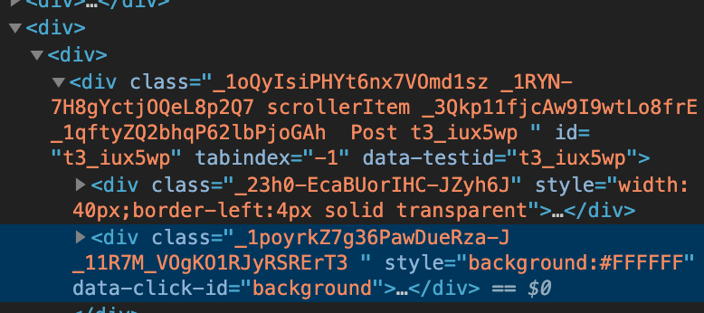

# Chrome extension remove Reddit Ads

## Installation Instructions

1. Download this repo as a [ZIP file from GitHub](https://github.com/florianherrengt/chrome-extension-remove-reddit-ads/archive/main.zip).
2. Unzip the file and you should have a folder named `chrome-extension-remove-reddit-ads-master`.
3. In Chrome go to the extensions page (chrome://extensions).
4. Enable Developer Mode.
5. Drag the `chrome-extension-remove-reddit-ads-master` folder anywhere on the page to import it (do not delete the folder afterwards).

## Why?

Reddit is making impossible to block their ad with a CSS selector.

